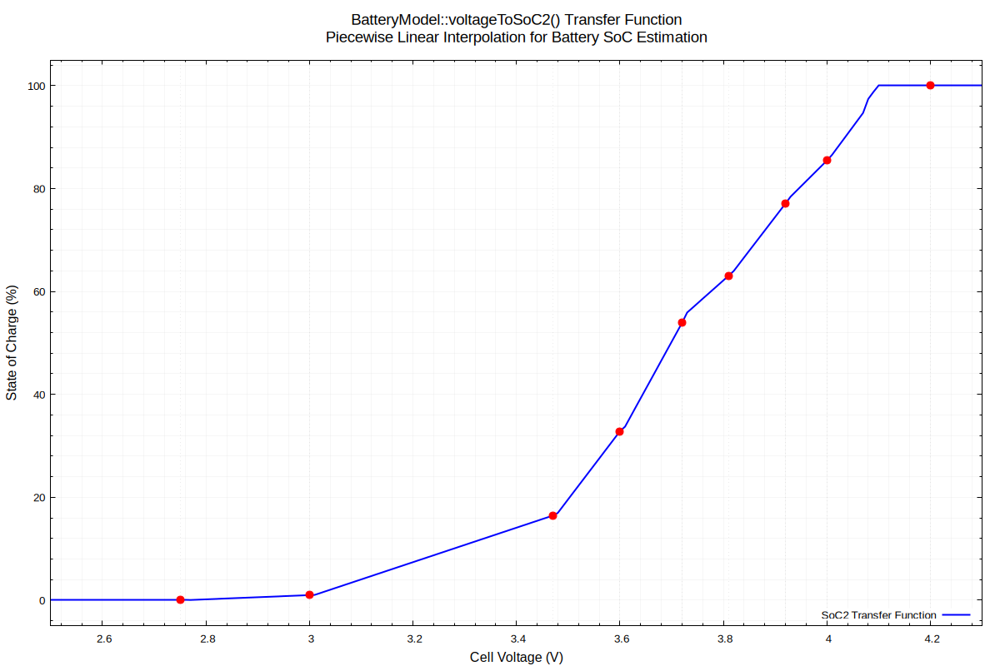

# MIevM - Battery Management System CAN Bridge

A CAN bus bridge firmware for Mitsubishi i-MiEV vehicles to enable battery pack upgrades. This project translates CAN messages between the vehicle and aftermarket battery packs (originally developed for CATL 93Ah NMC cells).

## Target Hardware

**Board**: "MB CAN STM32" or "MB Filter" (commonly sold with blue PCB) from
vendors on AliExpress.
- **MCU**: STM32F105RBT6 (Connectivity Line with dual CAN peripherals)
- **CAN Bus**: Dual CAN transceivers (CAN1 and CAN2)

## Acknowledgements

This project is a C++ rewrite of the original C implementation:

- **Original Project**: [iso14000/MIevM](https://github.com/iso14000/MIevM/tree/main) by FSI (Florent)
- **Based on**: PIEV MIM (Mitsubishi i-MiEV CATL93 upgrade) for Arduino Due + CAN shield

This rewrite adds comprehensive unit testing, improved type safety, and modern C++ software engineering practices while maintaining functional compatibility with the original.

It also adds a build system that relies only on standard command-line build tools -  cmake, make, gcc, stlink-tools

## Features

- **Battery Model**: Dual state-of-charge (SoC) estimation
  - **SoC1**: Coulomb counting (charge integration)
  - **SoC2**: Voltage-based estimation with calibration during rest periods
- **Heartbeat Transmission**: Periodic status message (on PID 0x720)
  - Includes software version and uptime counter, more diagnositcs to follow. 
- **Comprehensive Unit Testing**

### Current Limitations (v1.0)
- **No sleep mode** implemented
- **No regenerative braking control** (low-temperature protection)

## Heartbeat Message (0x720)

The firmware transmits a heartbeat message on both CAN buses every second:

| Byte | Content | Description |
|------|---------|-------------|
| 0 | Major Version | Software major version (e.g., 1) |
| 1 | Minor Version | Software minor version (e.g., 0) |
| 2 | Reserved | Reserved for future use (0x00) |
| 3 | Reserved | Reserved for future use (0x00) |
| 4-7 | Uptime | System uptime in seconds (uint32_t, big-endian) |

Example: `01 00 00 00 00 00 0E 10` = Version 1.0, uptime 3600 seconds (1 hour)

## Quick Start

### Prerequisites

- Your host toolchain for building and running the unit tests (`build-essential`, includes `g++` and `make`)
- CMake 3.14 or higher (`cmake`)
- ARM GCC toolchain for building the target firmware (`arm-none-eabi-gcc`)
- Optional:
	- ST-Link programmer for flashing (`stlink-tools`)
	- For generating test coverage reports (`lcov`)

### Building the Firmware

```bash
# Build firmware (using build script)
./build.sh

# Or use Make targets
make              # Build firmware (release mode)
make tests        # Build and run unit tests
make help         # Show all available Make targets
```

#### Available Make Targets

```
make                  - Build firmware (release mode)
make firmware         - Build firmware (release mode)
make firmware-debug   - Build firmware (debug mode)
make tests            - Build and run unit tests
make tests-verbose    - Run tests with verbose output
make tests-coverage   - Run tests with coverage report
make clean            - Clean firmware build
make clean-tests      - Clean test build
make clean-all        - Clean all builds
make flash            - Flash firmware to STM32 using `st-flash` utility
make help             - Show this help message
```

Output firmware binary: `build/MIevM.bin`

Output firmware srec file: `build/MIevM.srec`

### Running Tests

```bash
# Run all unit tests
./test.sh

# Run with verbose output
./test.sh -v

# Generate coverage report
./test.sh --coverage
```

For detailed test information, see [test/README.md](test/README.md).

For more information about the unit test framework, see [cpputest/README.md](cpputest/README.md).


### Understanding the Code

- **Firmware Architecture**: See [Src/README.md](Src/README.md) for main program structure


## SOC2 Voltage→SOC Transfer Function

Implementation in `BatteryModel::voltageToSoC2()`



Refer to the [documentation](documentation/) directory for how to recreate this plot if needed.

## Project Structure

| Directory | Description |
|-----------|-------------|
| **Src/** | Main firmware source code (C++, App, BatteryModel, CAN handlers) |
| **Inc/** | Header files (interfaces, CAN types, HAL configuration) |
| **test/** | Unit tests using CppUTest framework |
| **Drivers/** | STM32 HAL drivers and CMSIS headers |
| **build/** | Build output directory (firmware binaries, object files) |
| **cpputest/** | CppUTest framework source (testing dependency) |
| **documentation/** | Transfer function plots and generation tools |
| **.vscode/** | VS Code configuration (build tasks, debugger setup) |

## Build Artifacts

- `build/MIevM.bin` - Flashable firmware binary
- `build/MIevM.srec` - S-record format firmware
- `build/MIevM.lst` - Assembly listing with symbols
